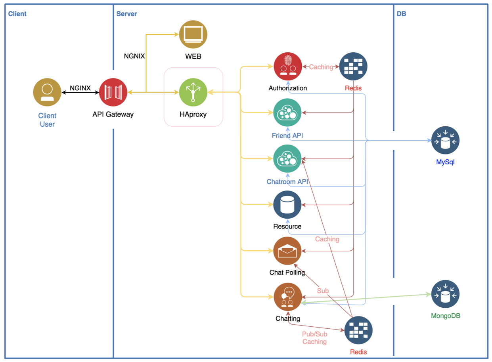
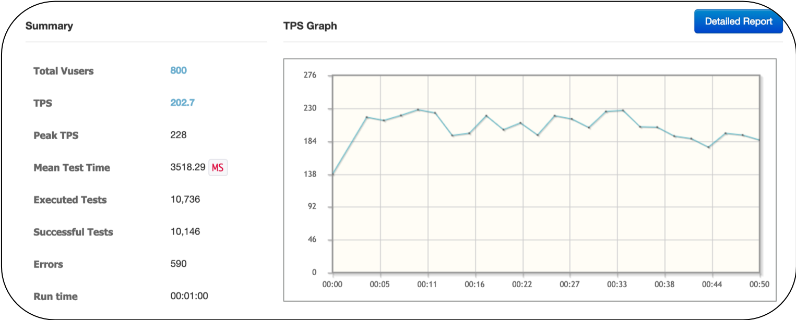
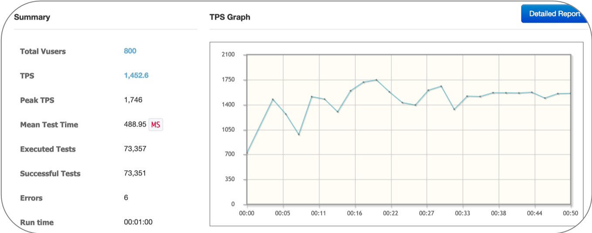
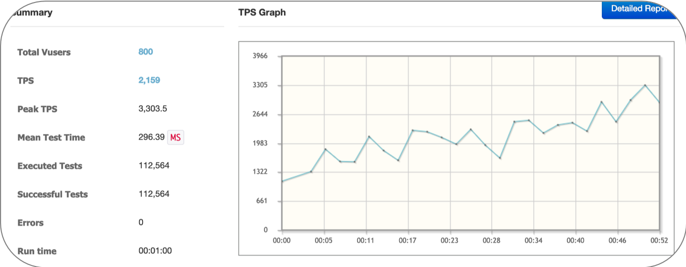
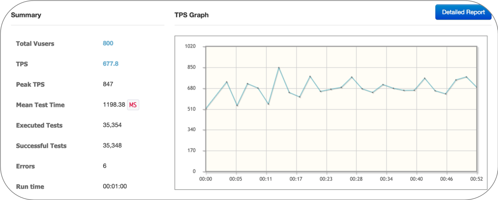

<a name="top">
  
# WebKakao
  
</a>


## 목차

#### [1. 프로젝트 설명](#about_project)
#### [2. WebKakao 기능](#functions)
#### [3. 아키텍처](#architecture)
#### [4. 데모 영상](#demo_video)
#### [5. 성능 테스트](#performance_test)
#### [6. 문서 링크](#docs_link)
#### [7. Docker](#docker)


</br>

<a name="about_project">  

### 1. 프로젝트 설명

</a>
  
##### 1-1. 프로젝트 기획

 > 대용량 트레픽을 고려한 웹 메신저

##### 1-2. 프로젝트 목적
 - Micro Service Architecture의 이해
 - Scale Out 가능한 구조의 설계 및 구현
 - 메신저 및 실시간 채팅 서비스에 대한 이해
 - HAProxy를 통한 HA구성 및 부하 테스트 진행  
  
[맨 위로 가기](#top)
</br>


<a name="functions">  

### 2. WebKakao 기능

</a>

 - 실기간 채팅
 - 친구 목록 관리
 - 실시간 읽은 메세지 처리
 - 파일 및 사진 전송
 - 프로필 사진 및 관리  
...
  
[맨 위로 가기](#top)
</br>
  
<a name="architecture">  

### 3. 아키텍처

</a>
  
  
  
[맨 위로 가기](#top)
</br>
  
<a name="demo_video">  

### 4. 데모 영상

</a>  

[](https://www.youtube.com/watch?v=sjIW45YZQ0U)
  
[맨 위로 가기](#top)
</br>
  
<a name="performance_test">  

### 5. 성능 테스트

</a>  

 - 테스트 환경
  

|                  | OS           | CPU                        |  RAM |
|:----------------:|--------------|----------------------------|:----:|
|      Server      | Ubuntu 18.04 | Intel(R) Core(TM) i5-5200U | 8 GB |
| NGrinder Controller/Agent | MAC - OS X   | Intel(R) Core(TM) i5-5257U | 8 GB |
  
  
> agent 1대 – Process 4, Thread 200 / POST / DB Query 2회 기준
  
1. 초기 테스트 결과
  
  
> 원인 분석 
  
2. Google GET 결과
  
  
3. "hello"를 리턴하는 GET 메서드 결과
  
  
> **DB Query**에 오버헤드가 있음을 인지

 - Tomcat - Server.xml 수정 (acceptCount, maxConnection, maxThread …)
 - Server - DB Connection Pool 설정, Logger level 변경
 - MySQL - Server config 수정 (max_connections, Innodb_max_pool_size,Innodb_id_capacity…)


4. 최종 결과
  
  
[맨 위로 가기](#top)
</br>
  
<a name="docs_link">  
  
### 6. 문서 링크

</a>
  
#### Authorization Server
#### API Server
#### [Chatting Server](src/ChattingServer)
#### Polling Server
#### File Server
#### React Client
#### MongoDB Data Type
#### MySQL Data Type
#### Redis Data Type

[맨 위로 가기](#top)
</br>

<a name="docker">

### 7. Docker

실행방법
각 Project 빌드 후
`docker-compose up -d`(daemon)
상황에 맞게 docker-compose.yml 변경하여 사용
`docker-compose -f "filepath" up -d`

**Maven project**
maven 설치 후
`mvn package`

**Gradle project**
`./gradlew build`

**Node project(React)**
`npm run-script build`

기존의 Database를 사용하기 위해서는 DB path를 수정
```
# docker-compose.yml
...
  mysql: 
    ...
    volumes:
      ...
      <DB path>:/var/lib/mysql
```


[맨 위로 가기](#top)
</br>


